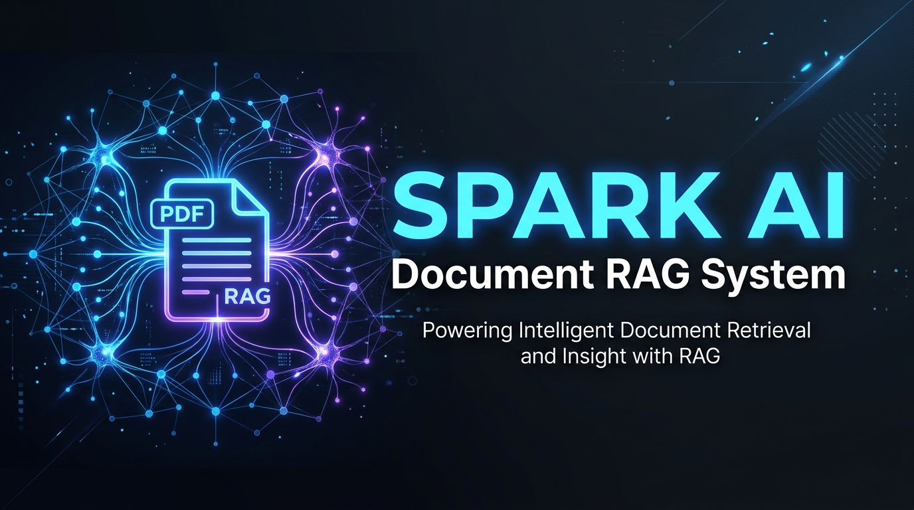

<div align="center">
  
</div>

# Spark AI - Local RAG Application

Welcome to the **Spark AI Local RAG Application** repository. Built specifically for AI consulting, training, and operational workflows, this application allows you to converse with your proprietary company documents—completely locally, with zero complicated infrastructure.

## 🚀 Features
- **Multi-Format Ingestion**: Seamlessly upload and embed PDFs, Markdown (`.md`), and raw text (`.txt`) files.
- **Local Persistence**: Vector embeddings are saved locally in the `company_vector_db` folder, so you don't have to re-upload massive documents every time you launch the app.
- **Lightning Fast Retrieval**: Powered by Facebook's FAISS in-memory vector database.
- **Modern AI Orchestration**: Uses LangChain Expression Language (LCEL) and Google's latest `gemini-2.5-flash` and `gemini-embedding-2` models.
- **Clean UI**: A beautiful, intuitive frontend built with Streamlit.

## 🛠 Tech Stack
- **Frontend**: [Streamlit](https://streamlit.io/)
- **Orchestration**: [LangChain](https://python.langchain.com/)
- **Vector DB**: FAISS
- **Models**: Google Gemini 2.5 Flash & Gemini Embedding 2

---

## 💻 Getting Started

### 1. Clone & Setup
Clone this repository to your local machine:
```bash
git clone <your-repo-url>
cd <your-repo-folder>
```

Create a virtual environment and install the dependencies:
```bash
python3 -m venv .venv
source .venv/bin/activate
pip install -r requirements.txt
```

### 2. Configure API Keys
This app uses Google Gemini. You will need a free API key from [Google AI Studio](https://aistudio.google.com/app/apikey).
1. Create a `.env` file in the root of the project.
2. Add your API key:
   ```env
   GOOGLE_API_KEY="your-api-key-here"
   ```

### 3. Run the App
If you are on a Mac, simply double-click the included `Start_App.command` file from Finder! 

Alternatively, launch it from the terminal:
```bash
source .venv/bin/activate
streamlit run rag_app/app.py
```

### 4. Optional: Swapping to Local Models (Ollama)
If you want to run this application 100% locally with zero cloud dependencies for maximum privacy, you can easily swap out the Google Gemini models for local open-source models using [Ollama](https://ollama.com/).

1. Install Ollama and pull your desired models:
   ```bash
   ollama run llama3
   ollama pull nomic-embed-text
   ```
2. In `rag_app/rag_core.py`, replace the Google imports:
   ```python
   # Replace this:
   # from langchain_google_genai import GoogleGenerativeAIEmbeddings, ChatGoogleGenerativeAI
   
   # With this:
   from langchain_community.embeddings import OllamaEmbeddings
   from langchain_community.chat_models import ChatOllama
   ```
3. Swap the initialization code:
   ```python
   # Embeddings
   embedding_model = OllamaEmbeddings(model="nomic-embed-text")
   
   # LLM (inside ask_question)
   llm = ChatOllama(model="llama3", temperature=0.3)
   ```

## 🏢 About Spark AI
Spark AI provides top-tier AI consulting, teaching, and workshops across the Ventura and Santa Barbara areas. We help businesses integrate practical, secure, and modern artificial intelligence into their daily operations.
